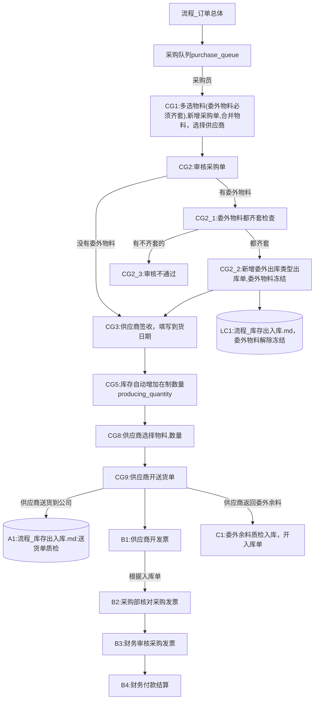

# 作业1：*****
## 赵卫东 软件18-3 学号***
### AAAA
#### AAA

markdown格式
dsfasdf

实验结果见图片：

图片2：

```mermaid
graph TD;
    流程_订单总体-->CG0["采购队列purchase_queue"]
    CG0--采购员-->CG1["CG1:多选物料(委外物料必须齐套),新增采购单,合并物料，选择供应商"]
    CG1-->CG2["CG2:审核采购单"]
    CG2--没有委外物料-->CG3["CG3:供应商签收，填写到货日期"]
    CG2--有委外物料-->CG2_1["CG2_1:委外物料都齐套检查"]
    CG2_1--都齐套-->CG2_2["CG2_2:新增委外出库类型出库单,委外物料冻结"]
    CG2_1--有不齐套的-->CG2_3["CG2_3:审核不通过"]
    CG2_2-->CG3
    CG2_2-->LC1[("LC1:流程_库存出入库.md，委外物料解除冻结")]
    CG3-->CG5["CG5:库存自动增加在制数量producing_quantity"];
    CG5-->CG8[CG8:供应商选择物料,数量]
    CG8-->CG9[CG9:供应商开送货单]
    CG9--供应商送货到公司-->A1[("A1:流程_库存出入库.md:送货单质检")]
    CG9-->B1["B1:供应商开发票"]--根据入库单-->B2["B2:采购部核对采购发票"]-->B3["B3:财务审核采购发票"]-->B4["B4:财务付款结算"]
    CG9--供应商返回委外余料-->C1["C1:委外余料质检入库，开入库单"]
```
